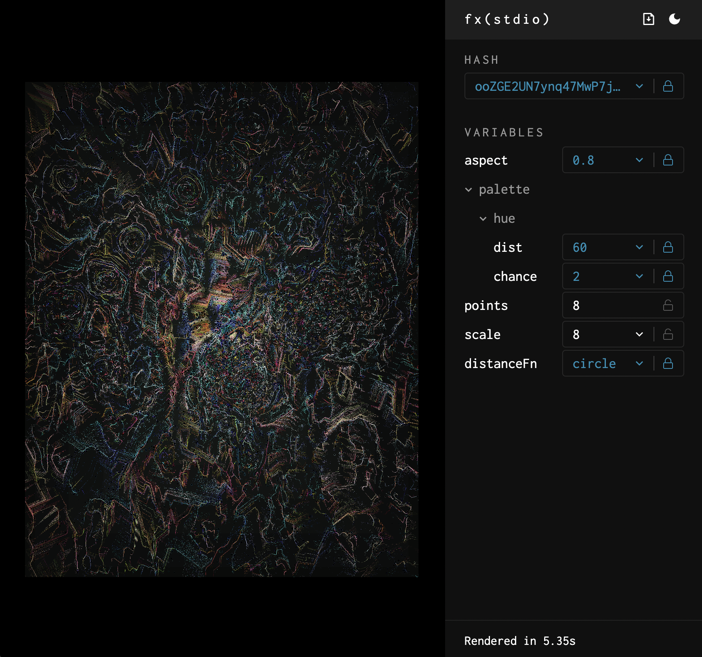
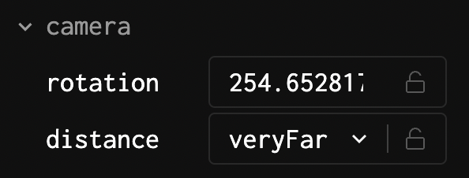

# fx(stdio) – the generative artist's studio

fx(stdio) makes it easy to control the hash and other variables
for your fx(hash) projects.



## Installation

Add to your fx(hash) project:

```bash
npm install @altesc/stdio
```

Add the plugin to your webpack config, and instruct the dev server to open at
the `/stdio` URL path. If you're using the [fxhash webpack boilerplate](https://github.com/fxhash/fxhash-webpack-boilerplate), it would look like this:

```js
// In webpack.config.dev.js
const config = require("./webpack.config");
const StdioWebpackPlugin = require("@altesc/stdio/webpack-plugin");

module.exports = {
  ...config,
  mode: "development",
  devServer: {
    // ...other options...
    open: "/stdio",
    // ...other options...
  },
  plugins: [
    ...config.plugins,
    // Add the plugin
    new StdioWebpackPlugin(),
  ],
};
```

Restart your webpack dev server.

## Usage

fx(stdio) is available at the `/stdio` URL path. To view your project without
the fx(stdio) UI, simply open the root (`/`) path instead.

fx(stdio) will automatically detect and allow you to control the hash.
To control other variables, replace your p5js `random()` or `fxrand()` calls
with the equivalent from `stdio`, with the addition of a unique `name` as the
first argument. This name will be shown in the UI, as well as used to persist
values between reloads.

### random()

Generates a random number.

```ts
function random(
  name: string,
  min: number = 0,
  max: number = 1,
  transform?: (x: number) => number
): number;
```

Examples:

```ts
import { random } from "@altesc/stdio";

// random number between 0 and 1 (exclusive)
const chance = random("chance");

// random integer between 0 and 100 (exclusive)
const width = random("width", 0, 100, Math.floor);
```

### random(arrayOrObject)

Choose a random option out of an array or object.

```ts
function random<T>(name: string, choices: T[] | { [key: string]: T }): T;
```

Examples:

```ts
import { random } from "@altesc/stdio";

// random choice out of "circle", "square", or "diamond"
const shape = random("shape", ["circle", "square", "diamond"]);

// non-primitive choices (objects or functions) should use the object form
const shapeFn = random("shapeFn", {
  circle: () => drawCircle(),
  square: () => drawSquare(),
  diamond: () => drawSquare({ rotateDegrees: 45 }),
});

// object form can also be used if you simply want to give names to the choices
const distance = random("distance", {
  near: 10,
  far: 20,
  veryFar: 60,
});
```

Different weights can be applied so that choices are not equally likely:

```ts
import { random, weight } from "@altesc/stdio";

// 50% chance of getting "circle",
// 30% chance of getting "square", and
// 20% chance of getting "diamond"
const shape = random("shape", [
  weight(50, "circle"),
  weight(30, "square"),
  weight(20, "diamond"),
]);

// If unspecified, the default weight is 1;
// in the below scenario, "circle" is twice as likely as "square"
const shapeFn = random("shapeFn", {
  circle: weight(2, () => drawCircle()),
  square: () => drawSquare(),
});
```

### randomGaussian()

Generates a random number fitting a normal distribution.

```ts
function randomGaussian(
  name: string,
  mean: number = 0,
  sd: number = 1,
  transform?: (x: number) => number
): number;
```

Examples:

```ts
import { randomGaussian } from "@altesc/stdio";

// random number with mean 0 and standard deviation 1
const length = randomGaussian("length");

// random integer with mean 50 and standard deviation 10
const count = randomGaussian("count", 50, 10, Math.floor);
```

## Advanced

### Variable grouping

If you have a lot of variables and would like to create groupings in the UI,
you can prefix a variable name with a common group name(s), separated by a `/`
(think of it like a directory structure).

```ts
const rotation = random("camera/rotation", 0, 360);
const distance = random("camera/distance", {
  near: 10,
  far: 20,
  veryFar: 60,
});
```

The above would be displayed like this:


