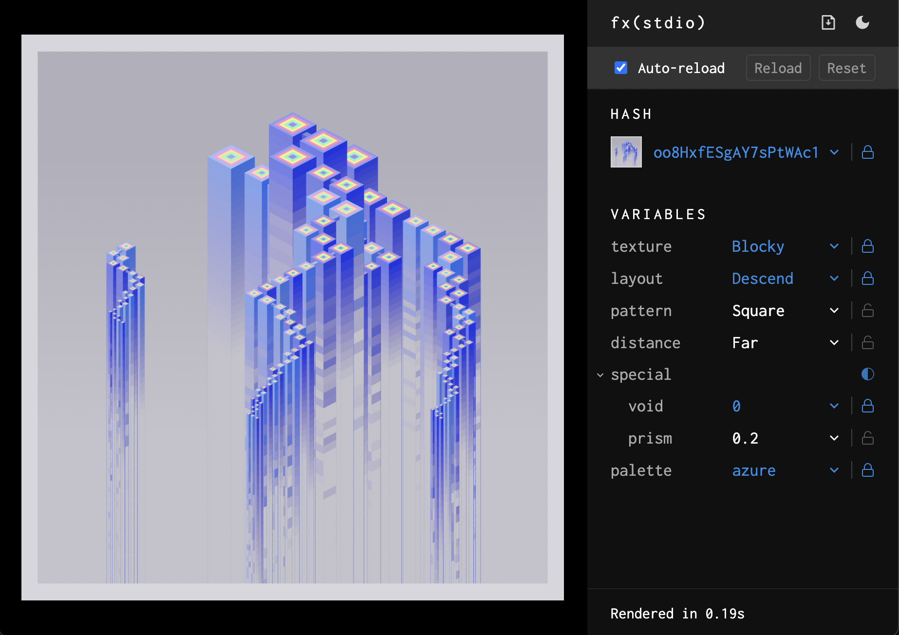

# fx(stdio) – the generative artist's studio

A studio made for fx(hash). Control the hash and other variables with ease.

For installation and documentation, visit the [website](https://altesc.art/stdio).
